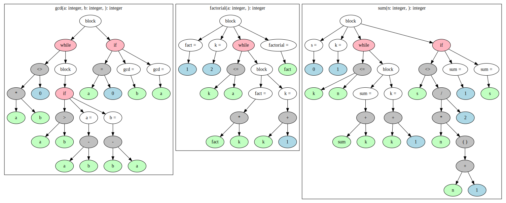

# A recursive descent parser for Pascal
Recursive descent parser for (Mini-)Pascal that is able to print out the AST in textual form (in a somewhat LISP like syntax) or print it out as .dot file in order to render it as a graph with GraphViz.

## Usage
Todo

## Example output
Given this input code:
```pascal
program minipas;
  var a,y: integer;
      b, i: integer;
      x: array [1..100] of real;

  function gcd (a, b: integer) : integer;
  begin
    while a*b <> 0 do
    begin
      if a > b then
        a := a-b
      else b := b-a;
    end;
    if a = 0 then
      gcd := b
    else gcd := a;
  end;


  function factorial (a: integer) : integer;
  var k, fact: integer;
  begin
    fact := 1;
    k := 2;
    while k <= a do
    begin
      fact := fact*k;
      k := k+1;
    end;
    factorial := fact;
  end;

  function sum (n: integer) : integer;
  var s, k: integer;
  begin
    s := 0;
    k := 1;
    while k <= n do
    begin
      sum := sum+k;
      k := k+1;
    end;
    if s <> n*(n+1)/2 then
      sum := -1
    else sum := s;
  end;
```

the parser spits out either following text representation of the AST:
```
(program minipas (defs  (a: integer) (y: integer) (b: integer) (i: integer) (x: real[1..100]))

(method gcd (args (a: integer) (b: integer) (defs)
((while (<> (* a b) 0) (do ((if (> a b) (then (assign a := (- a b))) (else (assign b := (- b a)))))))(if (= a 0) (then (assign gcd := b)) (else (assign gcd := a))))

(method factorial (args (a: integer) (defs (k: integer) (fact: integer))
((assign fact := 1)(assign k := 2)(while (<= k a) (do ((assign fact := (* fact k))(assign k := (+ k 1)))))(assign factorial := fact))

(method sum (args (n: integer) (defs (s: integer) (k: integer))
((assign s := 0)(assign k := 1)(while (<= k n) (do ((assign sum := (+ sum k))(assign k := (+ k 1)))))(if (<> s (/ (* n (group (+ n 1))) 2)) (then (assign sum := 1)) (else (assign sum := s))))
```

or the following graph:

